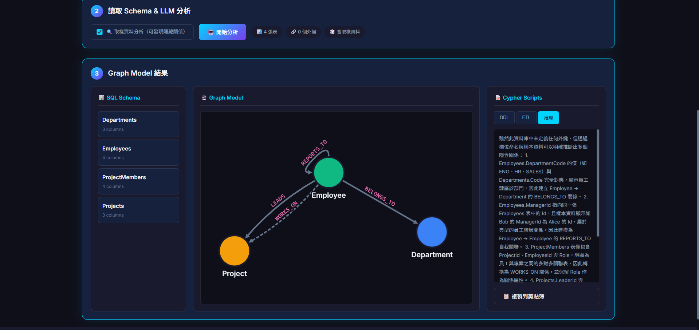

# SQL2Graph 🔮

> LLM 驅動的 SQL Server Schema 轉 Neo4j Graph Model 工具

[](https://dotnet.microsoft.com/)
[](https://blazor.net/)
[](https://neo4j.com/)

## 🎯 功能特色

- **自動讀取 SQL Schema** — 連接 MSSQL，自動讀取 Tables、Columns、Foreign Keys
- **LLM 智能分析** — 使用 Azure OpenAI 理解語意，產生最佳 Graph Model
- **Sample Data 推斷** — 即使沒有 FK 定義，也能從資料內容推斷隱藏關係
- **互動式視覺化** — 力導向圖，節點可拖拉，連線會 highlight
- **自動產生 Cypher** — DDL (Constraints/Index) + ETL (資料遷移腳本)
- **中文支援** — 描述和推理解釋使用繁體中文

## 📸 隱式關聯推論 (Implicit Relationship Inference)

下圖展示了一個**缺乏外鍵約束 (Foreign Key Constraints)** 的資料庫結構。SQL2Graph 透過 **語意資料分析 (Semantic Data Analysis)** 技術，結合 Schema 定義與取樣資料，成功識別出潛在的實體關聯 (Latent Entity Relationships)：



---

## 🔬 與傳統工具的技術比較

| 功能 | 傳統 ETL 工具 (Neo4j ETL, APOC) | SQL2Graph |
|------|--------------------------------|-----------|
| 讀取 Schema Metadata | ✅ | ✅ |
| 依據 FK 建立 Relationship | ✅ | ✅ |
| **無 FK 時推斷關係** | ❌ 無法 | ✅ 透過 Sample Data |
| **語意化命名轉換** | ❌ 照抄表名 | ✅ `tbl_usr` → `User` |
| **產生中文描述** | ❌ | ✅ |
| **解釋設計決策** | ❌ | ✅ 推理面板 |
| 視覺化預覽 | ⚠️ 需另開工具 | ✅ 內建力導向圖 |
| 產生 Cypher DDL/ETL | ✅ | ✅ |

### 技術實現差異

**傳統工具**採用 Rule-based 分析：
- 依賴 `INFORMATION_SCHEMA` 和 `sys.foreign_keys`
- 規則固定：有 FK → 建關係，無 FK → 無關係
- 命名直接對應，無語意理解

**SQL2Graph** 結合 LLM 語意分析：
- 讀取 Schema + 隨機取樣資料 (TABLESAMPLE)
- LLM 分析欄位名稱語意 + 資料值匹配
- 可發現隱藏關係（如 `DepartmentCode` → `Departments.Code`）
- 產生人類可讀的描述和設計理由

> **適用場景**：Legacy 系統、第三方資料庫、FK 未定義但有邏輯關聯的資料

---

## 🚀 快速開始

### 1. 設定 Azure OpenAI

```bash
copy appsettings.template.json appsettings.json
```

編輯 `appsettings.json`：
```json
{
  "AzureOpenAI": {
    "Endpoint": "https://your-resource.openai.azure.com/",
    "ApiKey": "your-api-key",
    "DeploymentName": "gpt-5.2-chat"
  }
}
```

### 2. 啟動應用

```bash
dotnet run
```

打開瀏覽器：`http://localhost:5000`

### 3. 連接資料庫並分析

1. 輸入 MSSQL 連線字串
2. 勾選「🔍 取樣資料分析」（推薦）
3. 點擊「開始分析」
4. 查看 Graph Model 視覺化和 Cypher 腳本

---

## 🔧 使用產生的 Cypher

### 安裝 Neo4j

```bash
docker run -d --name neo4j \
  -p 7474:7474 -p 7687:7687 \
  -e NEO4J_AUTH=neo4j/password123 \
  neo4j:latest
```

### 執行遷移

1. 在 Neo4j Browser (`http://localhost:7474`) 執行 DDL 腳本
2. 從 MSSQL 匯出 CSV
3. 執行 ETL 腳本匯入資料

---

## 🏗️ 技術架構

| 元件 | 技術 |
|------|------|
| 前端 | Blazor Server |
| 視覺化 | Cytoscape.js |
| LLM | Azure OpenAI (GPT-5.2) |
| 資料庫 | MSSQL (來源) → Neo4j (目標) |

---

## 📁 專案結構

```
SQL2Graph/
├── Components/
│   ├── Pages/Home.razor        # 主頁面
│   └── Layout/MainLayout.razor # 共用 Layout
├── Services/
│   ├── SchemaReaderService.cs  # 讀取 MSSQL Schema + Sample Data
│   ├── LlmAnalysisService.cs   # LLM 分析
│   └── GraphModelService.cs    # Cypher 產生
├── Models/
│   ├── SqlSchema.cs            # SQL 結構定義
│   └── GraphModel.cs           # Graph 結構定義
├── wwwroot/
│   ├── app.css                 # 樣式
│   ├── guide.html              # Graph DB 教學指南
│   └── js/graphVisualizer.js   # Cytoscape.js 封裝
└── docs/
    └── withoutFK.png           # 展示截圖
```

---

## 📄 License

MIT License
